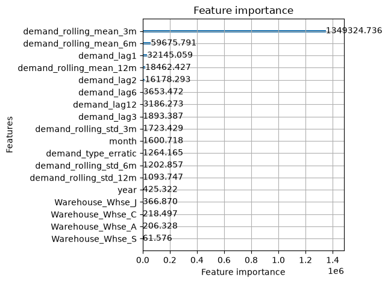
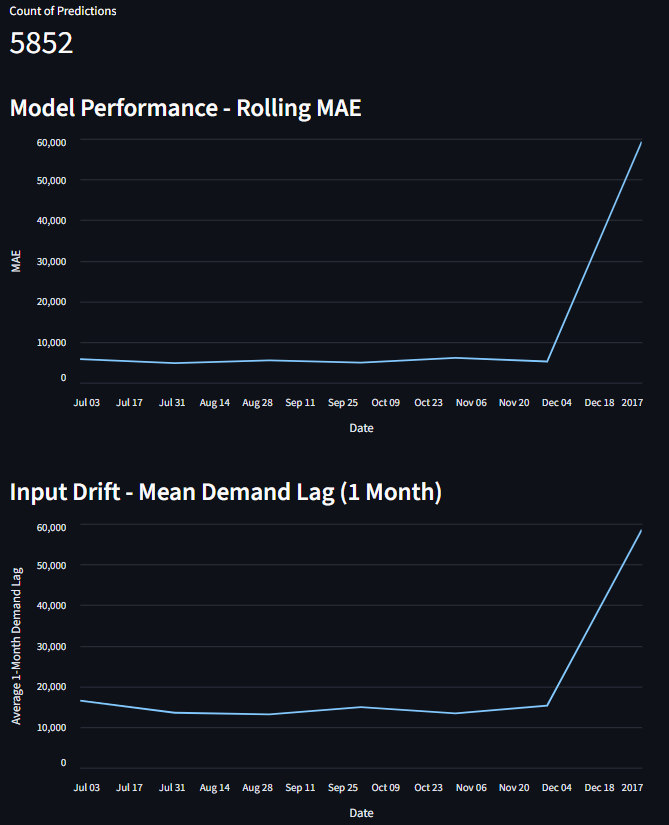

## Overview

An end-to-end manufacturing demand forecasting pipeline that translates SKU-level order demand predictions into inventory policy recommendations, packaged as a FastAPI service with SQLite logging, drift monitoring, and a GitHub Actions CI pipeline.

The demand types are classified by Syntetos-Boylan demand segmentation and routed to different forecasting methods by demand segment:
- Smooth and erratic demand: LightGBM with Optuna tuning
- Intermittent demand: Croston's SBA (a bias-corrected intermittent demand method)
- Lumpy demand: Inventory policy layer setting safety stock and reorder point levels with a 99% service level

This project demonstrates classical ML for time-series forecasting, demand segmentation using published academic frameworks, and ML engineering skills including model serving, prediction logging, input drift detection, and CI/CD.

## Business Problem

A global manufacturer with thousands of products across four regional warehouses, each with unique demand patterns, needs to overcome replenishment lead times exceeding one month due to ocean shipping. It is all but guaranteed to have excess inventory and some product-warehouse combination stockouts when manually setting safety stock levels and reorder points.

This project replaces manual inventory planning with a data-driven forecasting system that accounts for demand pattern heterogeneity. It converts forecast uncertainty into defensible safety stock and reorder point recommendations at a 95-99% target service level.

## Technical Approach

### Dataset and Preprocessing Decisions
- **Data:** Kaggle Product Demand Forecasting (felixzhao)
- **Preprocessing Decisions**:
    - Drop rows with `Date` nulls. All were missing at random where `Warehouse == Whse_A`.
    - Drop parenthesized `Order_Demand` values. Values like this are order cancellations and provide no value for forecasting.
    - Filter to `Order_Demand > 0`. Zero demand rows uninformative for forecasting.
    - Aggregating to monthly periods matches the forecast horizon and Syntetos-Boylan classification granularity.
    - Exclude `Product_Category == Category_019`. Demand volumes 100x greater than remainder of portfolio (median 18,000, max 10.45M, p99/median ratio 123x). Incompatible with a general ML pipeline. Handle separately in production.
    - One-hot encode `Warehouse` and `demand_type`. Few categories. Avoids implying ordinal relationship.

### Demand Classification Approach: Syntetos-Boylan, 2005

Classify demand per `Product_Code` x `Warehouse` combination.
1. Aggregate to monthly periods first. Daily is too sparse for ADI calc
2. Compute:
    - ADI = total months / months with non-zero demand
    - CV² = (std of non-zero demand / mean of non-zero demand)**2
3. Classify:

| Demand Type | ADI | CV² |
| --- | --- | --- |
| Smooth | < 1.32 | < 0.49 |
| Erratic | < 1.32 | >= 0.49 |
| Intermittent | >= 1.32 | < 0.49 |
| Lumpy | >= 1.32 | >= 0.49 |

### Modeling Strategy by Segment

| Demand Segment | % of Product_Code × Warehouse | Method |
|---|---|---|
| Smooth | 22% | LightGBM |
| Erratic | 24% | LightGBM |
| Intermittent | 7% | Croston's Method (SBA variant) |
| Lumpy | 47% | Safety stock buffer - conservative demand estimate |

### Validation Strategy

- **Split:** Train 2012–2015 | Validation Q1 2016 (3 folds) | Test July 2016–January 2017 (held out)
- **CV approach:** Fixed-origin rolling window, training data fixed, validation window moves across Q1 2016
- **Baselines:** Rolling 3-month mean and lag-1 evaluated first, all models required to beat the rolling mean
- **Metrics:** RMSE and MAE reported per demand segment, aggregate metrics mask segment-level performance differences
- **Test set:** Evaluated once after all modeling decisions were finalized, never used during model selection

### Inventory Policy Layer

The forecast is unreliable for lumpy demand types, so the inventory policy absorbs the uncertainty. A conservative historical mean with a wide safety stock buffer is applied, consistent with common practice for high-variability, low-frequency demand.

1. Conservative demand estimate per lumpy `Product_Code` x `Warehouse`
    - Use the historical mean demand from the training period as the demand estimate
2. Wide safety stock buffer
    - Use a higher Z value (ex: 2.33 for 99% service level) to reflect the higher uncertainty

Safety stock formula:
```text
SS = Z × sigma × √L

where:
  Z = service level multiplier
  sigma = standard deviation of demand over the period
  L = lead time in periods (1 month = 1 period)
```

mean_demand = mean of `Order_Demand` in training data  
sigma = std of `Order_Demand` in training data  
ROP = (mean_demand x L) + SS

### Production Packaging

- A FastAPI scoring endpoint running locally
- SQLite prediction logging
- A simulated production replay using held-out test data
- A Streamlit monitoring dashboard
- Rolling MAE and input drift signals
- GitHub Actions CI with unit tests
- **Known limitations:** Local deployment only, no authentication, not load tested, single instance

## Results

### Model Performance

| Segment | Method | Baseline MAE | Test MAE | Improvement |
| --- | --- | --- | --- | --- |
| Smooth | LightGBM default | 27,224 | 9,970 | 63% |
| Erratic | LightGBM default | 15,811 | 3,159 | 80% |
| Intermittent | Croston's SBA | 4,086 | 4,100 | 0.3% (within noise - see notes) |
| Lumpy | Safety stock buffer | --- | --- | Policy layer |

- The tuned model ended up slightly wose than the default model on RMSE and slightly better on MAE. There is a negligible difference and the default model has less bias
- Optuna tuning did not produce a meaningful improvement over default parameters, consistent with LightGBM's well-calibrated defaults on tabular data.
- Test performance nearly identical to CV performance. The model generalized cleanly on unseen data.
- The gap between CV and test is less than 2% on MAE for both segments, which means the CV results were not optimistic.
- Croston's test MAE (4,100) is slightly worse than CV MAE (3,685) - a 11% degradation. This is expected because Croston's produces a static forecast. The further you get from the training window, the less relevant the smoothed estimate becomes. It still beats the baseline.
- Croston's marginal improvement on the test set is within noise given the small intermittent sample size. CV showed a more meaningful 9.8% improvement. The methodological justification holds regardless of this specific test window result.
- The safety stock buffer covers 1,315 lumpy product × warehouse combinations with a mean safety stock of 10,658 units and mean reorder point of 14,940 units.

  
*The rolling window 3-month mean demand (also the baseline) is the strongest feature by far. It is more beneficial to know what the average demand has been over the past three months than what has more recently occured.*

### Monitoring Signals

- All months of held-out test data were within thresholds except the last month of predictions had a major spike in rolling mean MAE and 1-month mean demand lag.
- The spike in mean `demand_lag1` (~7,000 -> 60,000) means the input distribution shifted. The model is seeing demand values in January 2017 that are much larger than what it was trained on.
- The spike in MAE (~15,000 -> 60,000) means the model's predictions are worse as a result.
- The two moving together confirms the causal story: the inputs changed, which caused the outputs to degrade.
- In a production context this would trigger an investigation into what caused the January 2017 demand surge. Was it a one-time event or does the model need to be retrained?

  
*The January 2017 spike in both Rolling MAE and Mean Demand Lag confirms input drift as the cause of performance degradation - a retraining trigger in a production system.*


## Project Structure

```
manufacturing-demand-forecast/
├── api/
│   └── main.py                  # FastAPI scoring endpoint
├── src/
│   ├── predict.py               # Demand routing and prediction logic
│   ├── monitor.py               # SQLite logging and monitoring signals
│   └── simulate.py              # Test set production replay
├── dashboard/
│   └── app.py                   # Streamlit monitoring dashboard
├── notebooks/
│   ├── 01_eda.ipynb             # Exploratory data analysis
│   └── 02_modeling.ipynb        # Feature engineering, modeling, evaluation
├── tests/
│   └── test_predict.py          # Pytest unit tests
├── models/
│   └── lgbm_model.txt           # Trained LightGBM model
├── data/
│   └── ...                      # CSVs and SQLite database (gitignored)
├── .github/
│   └── workflows/
│       └── ci.yml               # GitHub Actions CI workflow
└── requirements.txt
```

## Known Limitations

### Data Limitations
- `Category_019` excluded. 33.9% of training rows, requires dedicated forecasting approach
- Lead time assumed at 28 days. Not observed in the data, grounded in dataset description only
- No cost data. Holding cost and stockout cost unavailable, dollar-denominated impact calculations require external assumptions

### Modeling Limitations
- Normal distribution assumed for safety stock formula. Likely violated for erratic and lumpy segments
- Syntetos-Boylan thresholds not tuned. Standard published values used, no dataset-specific optimization
- Single global model across all warehouses. `Whse_J` dominates volume and may warrant its own model
- No retraining cadence. Model trained once, January 2017 drift spike shows retraining is needed

### Production Limitations
- Local deployment only. No cloud hosting, no live URL
- No authentication
- Single instance. Not load tested
- Croston's forecasts are pre-computed offline. Not real-time inference